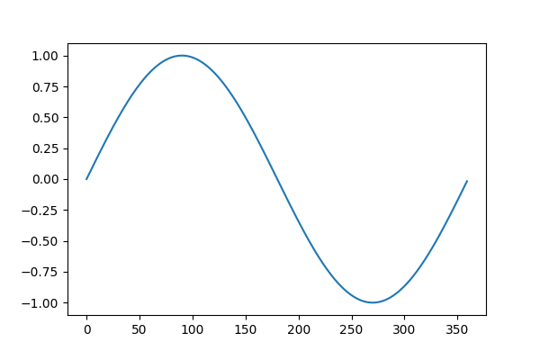
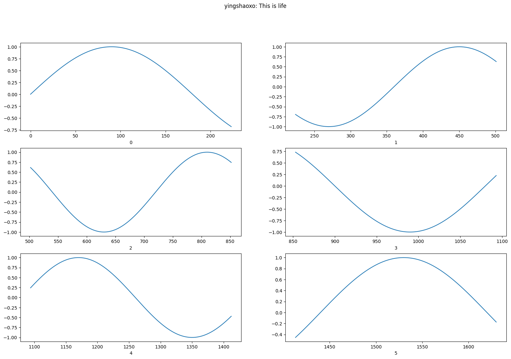

# Simple drawing

## Sine wave

```python
import numpy as np
import matplotlib.pyplot as plt

x = np.arange(0, 360)
y = np.sin(np.radians(x))

plt.plot(x, y)
plt.show()
```



## Subplot

```python
import numpy as np
import matplotlib.pyplot as plt

fig, figure_parts = plt.subplots(3, 2)
fig.suptitle('yingshaoxo: This is life')

degree = 0

for index in range(3 * 2):
    random_num = np.random.randint(180, 360, size=1)[0]
    
    x = np.arange(degree, degree + random_num) 
    y = np.sin(np.radians(x))
    degree += random_num
    
    ax = figure_parts[index//2][index%2]
    ax.set_xlabel(str(index))
    ax.plot(x, y)
    
fig.set_size_inches(19, 12)
plt.savefig('this is life.png', dpi=100, bbox_inches='tight' )
plt.show()
```



